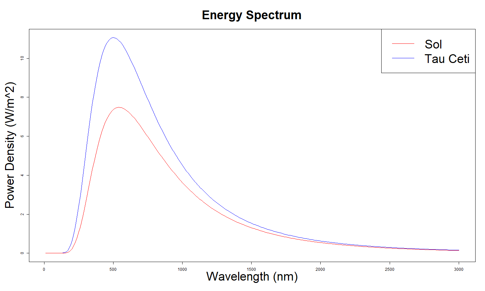

Travel to Near Solar Type Stars using Ion Engine
========================================================
author: SP  
date: 06/24/2019  
autosize: true  
transition: fade


Shiny Application: Solar Type
========================================================

The Solar Type application is written in R for implementation
in Shiny.  The app allows users to select one of the ten nearest
Solar Types to our sun and displays some of its properties.  Solar 
Types are stars that have similarities to the sun.

When a star is selected by the user, its distance from the sun is 
displayed along with some current information about its potential 
planets.  The app uses the temperature data from the star and plots 
its radiation (black body) spectrum in comparison to the sun's.

The app also calculates the time it would take an ideal spacecraft
to reach the planet and plots the spacecraft's velocity vs. time
given spacecraft characteristics supplied by the user.  

Along with star selection, the following inputs are available to the 
user:

- Ship Mass - The user can select ship mass using a slider.  The larger
the mass, the longer it will take for a ship to reach a star.

- Propellant Mass Ratio - The ratio of a ship's propellant mass to its 
total mass.  It is expected that the ship will expend all of its 
propellant during the journey.  The higher the ratio of propellant, 
the the shorter the trip will be.  However, with higher propellant
ratios, less payload will be delivered.

- Initial Velocity - Assumes that some effort to get the ship moving
at a high velocity prior to departing our solar system is provided.

- Engine Power - The power of the engine.  A more powerful engine will
reduce trip time.


Some Notes
========================================================

The calculations for energy spectrum use the standard black-body formula.

The calculations for trip time use the standard rocket formula assuming
an Ion drive that runs 100% of the time.  

The combination of user selected parameters may not be realistic.  For 
instance, selecting the minimum mass for the ship with the maximum 
propellant ratio and the maximum engine power level may not be practical
since there would be minimal mass allowed for power generation.

The calculations are ideal and don't take into consideration the reality
of a power plant supplying power for the length of time needed to make 
the trip or whether the ship itself could maintain functionality for 
such a long trip.  


Code Example for Calculating Black Body Radiation
========================================================

The following r code calculates black body radiation curves given temperatures
for the sun and for Tau Ceti.


```r
suntemp = 5778
taucetitemp = 5344

h = 6.62607004e-34                       # m2kg/s  Js
c = 2.99792458e8                         # m/s
k = 1.38064852e-23                       # m2kg/s2K  J/K
wavelength = seq(10,3000, by=10)            # nm
v = 1e9*c/wavelength                      # Hz

black_body<-data.frame

black_body <- ((1e9*8*pi*h*c/(wavelength/1e9)^5)/(exp(h*v/(k*suntemp))-1))/1e14
temp <- ((1e9*8*pi*h*c/(wavelength/1e9)^5)/(exp(h*v/(k*taucetitemp))-1))/1e14
black_body<-cbind(black_body,temp)
```

Plot of Black Body Radiation for Sol and Tau Ceti
========================================================


